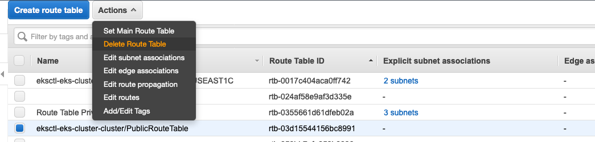

# PoC - EKS privado

_Consideraciones_

* Cluster privado de EKS.
* Load Balancer de carga privado.
* Accedido desde el API Gateway Privado.
* Y con el Ngnix ingress con la ultima version.

_Criterios de éxito_

* Tener un NLB interno enviando tráfico a una app de test vía un ingress de nginx
* Tener un ALB interno enviando tráfico directamente a una app de test

_Pasos ejecutados_

1. Crear un usuario IAM y darle permisos de AdministratorAccess. Este usuario se usará para crear el cluster y actuará como root del mismo. Es importante que guarden el ACCESS_KEY y SECRET_KEY pues será usado más adelante, e _ingresen  con ese nuevo usuario a la consola de AWS._ Si no se hace este paso, tener en cuentas las credenciales del usuario IAM con el que ingreso a la consola o configurar el usuario IAM creado dentro de los clients que van a interactuar con el cluster de EKS. Para garantizar que está usando el usuario indicado, ejecuten en su terminal el siguiente comando:

```
aws sts get-caller-identity
```

2. Pueden usar su terminal/shell para poder configurar el AWS CLI, y los demás tools kubectl, eksctl, ó  (Opcional) pueden crear un Cloud9 workspace para ejecutar los siguientes comandos, para ello deben buscar el servicio Cloud9 → Create environment → (Default Instance type, Platform: Amazon Linux 2)

3. Una vez tienes el workspace creado debes correr los siguientes pasos de configuración

* Hacer click en el  gear icon (en la parte superior derecha)
* Seleccionar **AWS SETTINGS**
* Turn off **AWS managed temporary credentials**
* Cerrar el TAB de preferences.


4. Luego se debe abrir un Terminal


5. Se debe configurar el AWS CLI, y las tools de EKSCTL con las credenciales del **paso 1** 

```
aws configure
AWS Access Key ID [None]: <YOUR ACCESS KEY>
AWS Secret Access Key [None]: <YOUR SECRET KEY>
Default region name [None]: <YOUR REGION>
Default output format [None]: <ENTER>

curl --silent --location "https://github.com/weaveworks/eksctl/releases/download/latest_release/eksctl_$(uname -s)_amd64.tar.gz" | tar xz -C /tmp
sudo mv -v /tmp/eksctl /usr/local/bin

sudo yum -y install jq gettext bash-completion moreutils

sudo curl --silent --location -o /usr/local/bin/kubectl \
   https://amazon-eks.s3.us-west-2.amazonaws.com/1.17.11/2020-09-18/bin/linux/amd64/kubectl

sudo chmod +x /usr/local/bin/kubectl

kubectl completion bash >>  ~/.bash_completion
. /etc/profile.d/bash_completion.sh
. ~/.bash_completion

```

6. Crear una política de IAM para el AWS Load Balancer Controller (instrucciones completas [acá](https://kubernetes-sigs.github.io/aws-load-balancer-controller/latest/deploy/installation/)).

```
curl -o iam_policy.json https://raw.githubusercontent.com/kubernetes-sigs/aws-load-balancer-controller/v2.1.3/docs/install/iam_policy.json

aws iam create-policy --policy-name AWSLoadBalancerControllerIAMPolicy --policy-document file://iam_policy.json

```


7.  Crear objeto ClusterConfig, pueden personalizar el siguiente YAML con el nombre del cluster y la región para desplegar el cluster.

```
cat > ~/environment/private-cluster.yaml <<-"EOF"
apiVersion: eksctl.io/v1alpha5
kind: ClusterConfig
metadata:
  name: eks-cluster
  region: us-east-1
  
# Enable IAM OIDC Provider and create sa for AWS Load Balancer Controller
iam: 
  withOIDC: true
  serviceAccounts:
  - metadata:
      name: aws-load-balancer-controller
      namespace: kube-system
    wellKnownPolicies:
      awsLoadBalancerController: true
      
nodeGroups:
  - name: ng1
    instanceType: m5.large
    desiredCapacity: 2
  # privateNetworking must be explicitly set for a fully-private cluster
  # Rather than defaulting this field to true for a fully-private cluster, we require users to explicitly set it
  # to make the behaviour explicit and avoid confusion.
    privateNetworking: true
  # If you want to enable ssh, uncomment the 2 following lines. 
    #ssh:
      #enableSsm: true
# CMK for the EKS cluster to use when encrypting your Kubernetes secrets
#secretsEncryption:
#  keyARN: <MASTER_ARN>
#cloudWatch:
    #clusterLogging:
        # enable specific types of cluster control plane logs
        #enableTypes: ["api", "scheduler", "controllerManager"]
EOF
```

Si desean editar el YAML anterior y ver como se puede personalizar, pueden ver las anotaciones en este link: 
https://eksctl.io/usage/eks-private-cluster/

8. Crear el cluster con el siguiente comando:

```
eksctl create cluster -f private-cluster.yaml
```

9. Por lo general, eksctl crea el archivo kubeconfig para interactuar con el clúster. y pueden validarlo con el comando 

```
vi ~/.kube/config
```

Si no lo hace, desde la terminal se debe descargar el kube/config para ser utilizado posteriormente en el ingreso al cluster desde el bastion privado. Este comando no puede ser ejecutado desde el bastion privado ya que el api de EKS requiere de acceso a Internet. 

```
aws eks --region <region-code> update-kubeconfig --name <cluster_name>
vi ~/.kube/config
```

En caso hayan creado el workspace de Cloud9 y  tengas problemas de ingreso al cluster, recomendamos revisar el archivo de configuración de AWS Credentials, y eliminar etiquetas vacias, como el "**aws_session_token =** "

```
vi ~/.aws/credentials
```

10. Verifiquemos que se haya creado una ServiceAccount para el AWS Load Balancer controller. Para ello, ejecutamos el siguiente comando y buscamos que en la lista esté aws-load-balancer-controller.

```
kubectl get sa -n kube-system
```

11. Clonar imágenes en repo privado desde la terminal/Shell o Workspace Cloud9. 

Un clúster privado sólo puede trabajar con imágenes de un repo privado y para ello vamos a usar ECR. Ya los endpoints de ECR fueron creados en el paso anterior. 

**Imágen para nginx usado para pruebas**

Cree variables de ambiente para el ID de la cuenta de AWS y la región. 

```
export ACCOUNT_ID=<Enter AWS Account ID>
export AWS_REGION=<Enter region ID>

aws ecr create-repository --repository-name nginx/nginx --region $AWS_REGION
docker pull nginx
docker tag nginx $ACCOUNT_ID.dkr.ecr.$AWS_REGION.amazonaws.com/nginx/nginx
aws ecr get-login-password --region $AWS_REGION | docker login --username AWS --password-stdin $ACCOUNT_ID.dkr.ecr.$AWS_REGION.amazonaws.com
docker push $ACCOUNT_ID.dkr.ecr.$AWS_REGION.amazonaws.com/nginx/nginx
```

**Imágenes para nginx-ingress** (tomado de [estas](https://kubernetes.github.io/ingress-nginx/deploy/#aws) instrucciones)

```
aws ecr create-repository --repository-name ingress-nginx/controller --region $AWS_REGION
docker pull k8s.gcr.io/ingress-nginx/controller:v0.44.0@sha256:3dd0fac48073beaca2d67a78c746c7593f9c575168a17139a9955a82c63c4b9a
docker tag k8s.gcr.io/ingress-nginx/controller:v0.44.0@sha256:3dd0fac48073beaca2d67a78c746c7593f9c575168a17139a9955a82c63c4b9a $ACCOUNT_ID.dkr.ecr.$AWS_REGION.amazonaws.com/ingress-nginx/controller:v0.44.0
docker push $ACCOUNT_ID.dkr.ecr.$AWS_REGION.amazonaws.com/ingress-nginx/controller:v0.44.0

aws ecr create-repository --repository-name jettech/kube-webhook-certgen --region $AWS_REGION
docker pull docker.io/jettech/kube-webhook-certgen:v1.5.1
docker tag docker.io/jettech/kube-webhook-certgen:v1.5.1 $ACCOUNT_ID.dkr.ecr.$AWS_REGION.amazonaws.com/jettech/kube-webhook-certgen:v1.5.1
docker push $ACCOUNT_ID.dkr.ecr.$AWS_REGION.amazonaws.com/jettech/kube-webhook-certgen:v1.5.1

```

Al validar en el servicio Amazon ECR, podran encontrar los repositorios recien creados


12. Instalamos el AWS Load Balancer  Controller (instrucciones completas [acá](https://kubernetes-sigs.github.io/aws-load-balancer-controller/latest/deploy/installation/)).

Primero instalamos el cert-manager.

```
kubectl apply --validate=false -f https://github.com/jetstack/cert-manager/releases/download/v1.0.2/cert-manager.yaml
```

Descargamos el YAML del AWS LB Controller.

```
wget https://raw.githubusercontent.com/kubernetes-sigs/aws-load-balancer-controller/v2.1.2/docs/install/v2_1_2_full.yaml
```

Deben abrir el archivo  `v2_1_2_full.yaml` y modificar la especificación del objeto _deployment_ usando el nombre de su clúster en el argumento _cluster-name_, (cerca de la línea 486, modifican el your-cluster-name con el nombre de su cluster) tal como se indica en las [instrucciones](https://kubernetes-sigs.github.io/aws-load-balancer-controller/latest/deploy/installation/). Despliegue el YAML en el clúster. 

```
kubectl apply -f v2_1_2_full.yaml
```

Verifiqué su instalación.

```
kubectl -n kube-system get all
```


13. Instalación del ingress-nginx (conforme [estas](https://kubernetes.github.io/ingress-nginx/deploy/#aws) instrucciones)

Descargué el YAML.

```
wget https://raw.githubusercontent.com/kubernetes/ingress-nginx/controller-v0.44.0/deploy/static/provider/aws/deploy.yaml
```

Dentro del YAML agregué la siguiente anotación al objeto **Service** para que el NLB que se crea sea interno, cerca de la línea 268.

```
service.beta.kubernetes.io/aws-load-balancer-internal: 'true'
```

Luego se debe reemplazar el URI de las imágenes en el YAML con las de los repos de ECR que creo previamente, esto para los containers ‘**controller**’, ‘**patch**’, y ‘**create**’. 

Para tomar las URI de **ingress-ngninx/controller**, deben ingresar al detalle del ECR Repository para **Ingress/controller** 


Luego dar click en la opción de Image URI / Copy URI


Y ese valor lo copian directamente en el repositorio del YAML, en la línea 327, para el componente **controller**

Ahora se debe ahora copiar el URI de **jettech/kube-webhook-certgen** y repetir lo mismo para **patch / create,** en las lineas 640 **(patch),** y línea 592 **(create),** 


Despliega el YAML:

```
kubectl apply -f deploy.yaml
```

Verifique la instalación:

```
kubectl -n ingress-nginx get all
```


14. Crear VPC endpoints en VPC del clúster. Cree un endpoint para estos servicios, en el momento de configurar el Security Group se debe asegurar de usar el security group del cluster que tiene como descripción "Communication between all nodes in the cluster", para permitir All Traffic desde los nodos del cluster  y tener comunicación con los servicios de forma privada a los VPC Endpoints

```
    com.amazonaws.<region-code>.sts
    com.amazonaws.<region-code>.ecr.dkr
    com.amazonaws.<region-code>.ecr.api
    com.amazonaws.<region-code>.ec2
    com.amazonaws.<region-code>.autoscaling
    com.amazonaws.<region-code>.logs
    com.amazonaws.<region-code>.cloudformation
    com.amazonaws.<region-code>.elasticloadbalancing
```

Para el Endpoint de S3 (com.amazonaws.<region-code>.s3) seleccione la opción Gateway. 


Y se debe seleccionar las Subnets donde se haya desplegado el cluster, 


15. Convierta su despliegue a un cluster privado

Elimine los registros de salida a Internet de las route tables de las subnets privadas. Para ello van a Servicio VPC → Subnets, buscan las subnets con la VPC ID, luego en el nombre encontraran cuales son privadas y cuales publicas, en la parte inferior en Rourte Table, sales las reglas y dan click en el nombre resaltado en azul, con el nombre completo del **Route Table:**


De allí buscan en la parte inferior las rutas, y "Edit Routes"
Eliminar la entrada de Destination 0.0.0.0/0, Target Nat, con la X al final de la línea. Esto se debe repetir para cada subnet, dado que el script de eksctl crea un route table por subnet.


Luego se debe eliminar el NAT Gateway, En Servicio VPC → Menu Izquierda (NAT Gateways) y se busca el NAT Gateway creado para el cluster. Se selecciona, dar click en "Actions", y luego "Delete NAT Gateway"


Mueva las subnets públicas a las route tables privadas correspondientes. Hay una route table por AZ.Se debe ir a cada Subnet Publica y realizar "Edit RouteTable" y escoger la Route Table correspondiente por AZ.


Elimine la route table pública.Ir al menu izquierda → Route Tables buscar el que tiene Nombre con el ClusterName y PublicRoute table.Dar click en "Actions" y luego "Delete Route Table"


Elimine el Internet Gateway asociado a la VPC del Cluster, se debe ir al Menu Izquierda → Internet Gateways, se busca el IGW y se da click en "Action", primero en "Detach from VPC" y luego se da click en "Delete Internet Gateway"

Luego convierta el endpoint del cluster de EKS a privado. Para ello se debe ir al Servicio Amazon EKS → Cluster → De click en el Cluster Name → Configuration → Networking → Manage networking → Seleccionar Private para el Cluster endpoint Access.  


Este proceso toma unos minutos, pero se puede seguir con los siguientes pasos. 

16. Construya los YAML y súbalos en el bucket de S3. Ejecute este paso desde su terminal. 

**YAML - test case 1 (AWS NLB interno → nginx-ingress → nginx)**

```
cat <<EoF > ~/environment/nginx-nlb.yaml
---
apiVersion: v1
kind: Namespace
metadata:
  name: nginx-nlb-ingress
---
apiVersion: apps/v1
kind: Deployment
metadata:
  name: nginx
  namespace: nginx-nlb-ingress
spec:
  selector:
    matchLabels:
      app.kubernetes.io/name: nginx-nlb-ingress
  replicas: 2
  template:
    metadata:
      labels:
        app.kubernetes.io/name: nginx-nlb-ingress
    spec:
      containers:
      - name: nginx
        image: <Enter ECR image>
        ports:
        - containerPort: 80
---
apiVersion: v1
kind: Service
metadata:
  namespace: nginx-nlb-ingress
  name: service-nginx-ingress-nlb
spec:
  ports:
    - port: 80
  selector:
    app.kubernetes.io/name: nginx-nlb-ingress
---
apiVersion: extensions/v1beta1
kind: Ingress
metadata:
  namespace: nginx-nlb-ingress
  name: ingress-nginx
  annotations:
    kubernetes.io/ingress.class: "nginx"
spec:
  rules:
    - http:
        paths:
        - backend:
            serviceName: service-nginx-ingress-nlb
            servicePort: 80
          path: /
EoF
```

Antes de subir el archivo, se debe editar en la linea 24 **(image: <Enter ECR image>)** e **** incluya la URI del repo de ECR de la imagen que vamos a usar de nginx/nginx. Creada en el **Paso 11.**


Como ahora todo el cluster va a estar privado para poder descargar información lo podrá hacer, únicamente desde ciertos servicios, para este caso se usara S3, por tanto es necesario que cree un Bucket con un nombre único en la región y cargué el YAML a S3:

```
export BUCKET_NAME=<Enter bucket name>
aws s3 cp nginx-nlb.yaml` s3``:``//$BUCKET_NAME`
```


**YAML - test case 2 (AWS ALB interno → nginx)**

```
cat <<EoF > ~/environment/nginx-alb.yaml
---
apiVersion: v1
kind: Namespace
metadata:
  name: nginx-alb
---
apiVersion: apps/v1
kind: Deployment
metadata:
  name: nginx
  namespace: nginx-alb
spec:
  selector:
    matchLabels:
      app.kubernetes.io/name: nginx-alb
  replicas: 2
  template:
    metadata:
      labels:
        app.kubernetes.io/name: nginx-alb
    spec:
      containers:
      - name: nginx
        image: <Enter ECR image>
        ports:
        - containerPort: 80
---
apiVersion: v1
kind: Service
metadata:
  namespace: nginx-alb
  name: service-nginx-alb
spec:
  ports:
    - port: 80
      targetPort: 80
      protocol: TCP
  type: NodePort
  selector:
    app.kubernetes.io/name: nginx-alb
---
apiVersion: extensions/v1beta1
kind: Ingress
metadata:
  namespace: nginx-alb
  name: ingress-nginx-alb
  annotations:
    kubernetes.io/ingress.class: alb
    alb.ingress.kubernetes.io/scheme: internal
    alb.ingress.kubernetes.io/target-type: ip
spec:
  rules:
    - http:
        paths:
          - path: /*
            backend:
              serviceName: service-nginx-alb
              servicePort: 80
EoF
```

Como en el caso anterior, antes de subir el archivo, se debe editar en la linea 24 **(image: <Enter ECR image>)** e **** incluya la URI del repo de ECR de la imagen que vamos a usar de nginx/nginx. Creada en el **Paso 11.**

Cargué el YAML a S3, al mismo bucket creado anteriormente

```
aws s3 cp nginx-alb.yaml s3://$BUCKET_NAME
```

Para un paso posterior es importante ejecutar el siguiente comando para poder instalar kubectl en el Bastion privado. 

```
mkdir installer
sudo curl --silent --location -o installer/kubectl https://amazon-eks.s3.us-west-2.amazonaws.com/1.17.11/2020-09-18/bin/linux/amd64/kubectl
aws s3 cp installer/kubectl s3://$BUCKET_NAME
```

**Verifique que los objetos estén dentro del Bucket**

```
aws s3 ls s3://$BUCKET_NAME
```

**Crear el bastion host en una de las Private Subnet**

Para este paso se deben crear tres cosas principales, el IAM Instance Role, los VPC endpoints para poder entrar por SSM a la instancia, y el bastion host con la instalación de kubectl.

**IAM Instance Role**

17. Para la creación del IAM Instance Role, vamos a la consola de IAM → Roles → Create Role → **Select type of trusted entity**, choose **AWS service**. → **Choose the service that will use this role**, choose **EC2 → Next Permissions.**

18. En la pagina de  **Attach permissions policies,** buscar y seleccionar **AmazonSSMManagedInstanceCore, CloudWatchAgentServerPolicy, AmazonS3FullAccess**

Ejemplo con **AmazonSSMManagedInstanceCore**: 


15. Luego le dan Next:Tags, si desean pueden agregar tag-key value pairs, y luego de dar Next le ponen el nombre **SSMInstanceProfile** u otro Nombre que les recuerde el uso. 

Más info en: https://docs.aws.amazon.com/systems-manager/latest/userguide/setup-instance-profile.html

**VPC Endpoints** 


Para acceder al bastion que estará en la subnet privada es necesario agregar unos VPC Endpoints que permitirán acceder con el servicio Session Manager.

10. Van al servicio VPC con el buscador de servicios. En el menu de la izquierda buscan **Endpoints → Create Endpoint.** se debe asegurar de usar el security group del cluster que tiene como descripción "Communication between all nodes in the cluster", para permitir All Traffic desde los nodos del cluster  y tener comunicación con los servicios de forma privada. Ejecutar para los siguientes endpoints

```
  com.amazonaws.<region-code>.ssm
  com.amazonaws.<region-code>.ssmmessages
  com.amazonaws.<region-code>.ec2messages
```

Para mas información del paso a paso, ver este link: https://aws.amazon.com/premiumsupport/knowledge-center/ec2-systems-manager-vpc-endpoints/

**Crear el Bastion Host**

19. Mientras está en proceso de carga los VPC Endpoints anteriores, debemos crear el Bastion Host, puede hacerlo ingresando al Amazon EC2 service, en el paso final de creación, no es requerido que el security group tenga configurado inbound rules.

* **Choose AMI:** Amazon Linux 2 (64-bits)
* **Instance Type:** t2.micro (opc. t2.large)
* **Configure Instance Details:**
    * **Network** (eksctl-eks-cluster-cluster/VPC)
    * **Subnet** (Una de las SubnetPrivate creadas)
    * **IAM Role** SSMInstanceProfile (Creado en el paso 6-8)
* Add Storage (default setup)
* Add Tags (opcional - Key/Name: Value/BastionHostPrivateCluster) 
* Configure Security Group (usar el security group que tiene como descripción: Communication between all nodes in the cluster)
* Review And Launch
* Select existing key pair (Pueden usar uno que ya tengan o escoger "Proceed without key pair")


20. Una vez la instancia ya esta corriendo, vamos a ingresar a ella, en la consola [entrar al servicio Amazon EC2](http://console.aws.amazon.com/ec2/), y buscar la instancia recién creada, al seleccionarla en la parte superior damos click en el botón "Connect", y seleccionamos la opción Session Manager, si completamos los pasos de IAM Role y VPC Endpoints, deberiamos ver algo como la siguiente pantalla, y damos click en Connect.


21. Configurar el AWS CLI con las credenciales del **paso 1** en el Bastion Privado

```
aws configure
AWS Access Key ID [None]: <YOUR ACCESS KEY>
AWS Secret Access Key [None]: <YOUR SECRET KEY>
Default region name [None]: <YOUR REGION>
Default output format [None]: <ENTER>
```

22. Al ingresar damos instalación en el Kubectl, con el instalador que se encuentra en S3

```
sudo aws s3 cp s3://$BUCKET_NAME/kubectl /usr/local/bin/kubectl
sudo chmod +x /usr/local/bin/kubectl
mkdir ~/.kube
vi ~/.kube/config
```

23. Una vez tengamos abierto **Vi,** vamos a copiar el archivo de configuración creado y descargado en el **paso 9**

24. Verificar la conexión con el cluster 

```
kubectl get nodes
```


**Realice los despliegues**_

**Test case 2 (AWS ALB interno → nginx)**

25. Obtenga archivos desde S3, desde el Bastion Privado

```
export BUCKET_NAME=<Enter bucket name>
cd ~
aws s3 cp s3://$BUCKET_NAME/nginx-alb.yaml nginx-alb.yaml
```

26. Despliegue el YAML

```
kubectl apply -f nginx-alb.yaml
```

27. Verifiqué su despliegue


```
kubectl -n nginx-alb get all
```


Busqué el balanceador de aplicaciones en la consola de AWS y copie el DNS, en la pestaña de Listener vaya a Rules y navegue hasta el target group dónde podrá ver las IPs de sus pods. 


Vuelva al bastion interno y haga un curl al DNS del balanceador.

```
curl <DSN del balanceador>
```


**test case 1 (AWS NLB interno → nginx-ingress → nginx)**

28. Obtenga archivos desde S3

```
aws s3 cp s3://$BUCKET_NAME/nginx-nlb.yaml nginx-nlb.yaml
```

29. Despliegue el YAML

```
kubectl apply -f nginx-nlb.yaml
```

30. Verifiqué su despliegue

```
kubectl -n nginx-nlb-ingress get all
```


Obtenga el DNS del balanceador y ejecute un curl.

```
kubectl -n nginx-nlb-ingress get ingress
```


---

## **Apéndice**

https://aws.amazon.com/blogs/containers/de-mystifying-cluster-networking-for-amazon-eks-worker-nodes/

https://docs.aws.amazon.com/eks/latest/userguide/create-public-private-vpc.html

https://eksctl.io/usage/eks-private-cluster/

https://aws.amazon.com/blogs/opensource/network-load-balancer-nginx-ingress-controller-eks/
* * *

